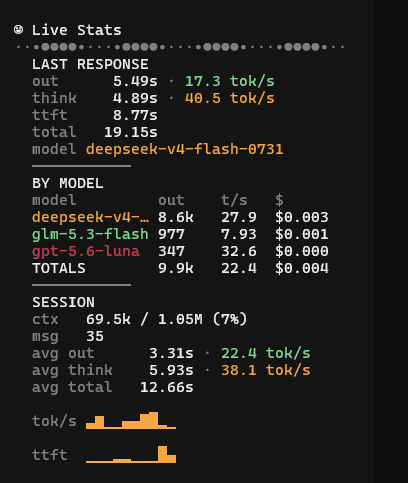

# 🙂 smiley-stats

<div align="center">

**Live token · speed · timing · cost stats for your [OpenCode](https://opencode.ai) sidebar.**



</div>

## Features

- **LAST RESPONSE**: answer time (`out`), thinking time (`think`), time-to-first-token (`ttft`), and total time — with answer and thinking speeds in tok/s.
- **BY MODEL**: per-model output tokens, average speed, and cost, sorted by spend, with a session total.
- **SESSION**: context usage, avg answer/think/total times, message count, avg answer speed, and animated sparklines for speed and ttft.
- **Live wave animation** under the title while a response is generating.
- **Thinking speed** is estimated from reasoning text when the provider doesn't report reasoning token counts.
- **Real-time pricing** pulled from the Surplus Intelligence markets API, falling back to provider-reported costs.

## Install

With OpenCode's plugin installer:

```sh
opencode plugin smiley-stats
```

Or reference it directly in your TUI config (`~/.config/opencode/tui.json`):

```json
{
  "plugin": ["./path/to/smiley.tsx"]
}
```

## Usage

Toggle the sidebar with `alt+b`. The plugin renders automatically for the active session. Optional keybind:

```json
{
  "keybinds": {
    "sidebar_toggle": "alt+b"
  }
}
```

## Notes

- `out` time = total − thinking − ttft, so `total = out + think + ttft` always holds.
- When no thinking happened, `think` and `avg think` show `-`.
- Pricing uses best per-million rates from `https://api.surplusintelligence.ai/api/markets`; costs fall back to provider-reported values if unavailable.

## License

MIT
